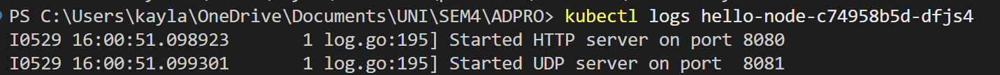

# Kayla Soraya Djakaria - 2306256381

## Reflection on Hello Minikube
1. Comparing the application logs before and after exposing it as a Service

Before I hit the app through the Service (or proxy), the only log lines in my Pod were the two startup messages:



Once I exposed the Deployment as a Service, each time I opened or refreshed the app in my browser I saw exactly one new “GET /” entry in the logs. For example, after two page-loads I saw:


If I refresh a third time, there’s a third “GET /” line, and so on. In other words, every HTTP request forwarded through the Service produces one log entry, and the total number of “GET /” lines grows in step with the number of times I open the app.


2. Purpose of the `-n` option


The `-n` (or `--namespace`) flag tells kubectl which Kubernetes namespace to operate in. By default, if you don’t supply `-n`, kubectl acts on the “default” namespace. When you run:

```bash
kubectl get pods,services
```

you see the Pods and Services you created (e.g. your `hello-node` Deployment) because they live in the “default” namespace.

When you run:

```bash
kubectl get pods,services -n kube-system
```

you switch context into the `kube-system` namespace, which is where Kubernetes itself runs its core components.


### Reflection on Rolling Update & Kubernetes Manifest File

1. Difference between Rolling Update and Recreate deployment strategy

The Rolling Update strategy allows you to update your application without downtime by incrementally updating Pods with new versions. It ensures that a certain number of Pods are always available during the update process. In contrast, the Recreate strategy stops all existing Pods before starting new ones, which can lead to downtime as there is a period when no Pods are available to serve requests.

2. Try deploying the Spring Petclinic REST using Recreate deployment strategy and document your attempt

I exported the existing Deployment into a file named deployment-recreate.yaml using by running command `kubectl get deployment spring-petclinic-rest -o yaml > deployment-recreate.yaml`. I then modified the file in part stratey section to change the deployment strategy to Recreate. Finally, I applied the new manifest withthe command `kubectl apply -f deployment-recreate.yaml`.

3. Prepare different manifest files for executing Recreate deployment strategy

I created a manifest file named `deployment-recreate.yml` for the Recreate deployment strategy. 


4. Benefits of using Kubernetes manifest files

Kubernetes manifest files provide a declarative way to define the desired state of your application. They allow you to version control your configurations, making it easier to track changes and roll back if necessary. Using manifest files simplifies the deployment process, as you can apply multiple resources at once with a single command (`kubectl apply -f`). This is more efficient than manually creating or updating resources one by one, reducing the risk of human error and ensuring consistency across deployments.